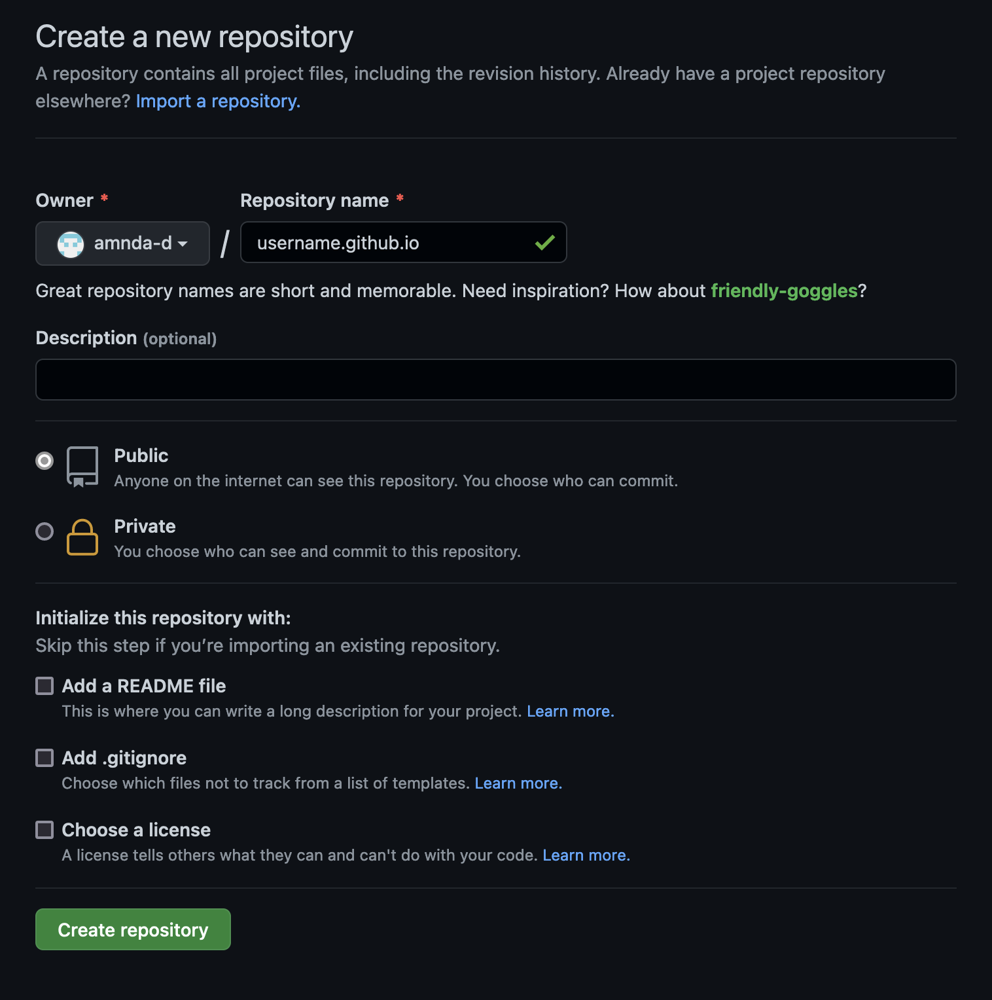

[GitHub Pages](https://docs.github.com/en/pages) and [Jekyll](https://jekyllrb.com/) allows you to easily create a simple website, hosted at `username.github.io`. In this tutorial, I'll show you how to make a single page academic website like this [Example Website](http://amandadoucette.com/example-website/). You won't need to write any code (although you can if you want) - just markdown and possibly some simple HTML.

## 1. Make a GitHub Account

[Sign up](https://github.com/signup?ref_cta=Sign+up&ref_loc=header+logged+out&ref_page=%2F&source=header-home) for an account. For this tutorial, you won't need to set up `git` on your computer. Everything can be done in a browser.

## 2. Create a Repository

Once you have an account, you'll need to create a repository. This is where the files that make up your website will be stored. Click the **+** in the top right corner, then **New repository**.

Enter `username.github.io` as the repository name (with your actual username, of course). You don't need to change any of the settings on this page.

## 3. Enable Pages in the Repository Settings

After creating the repository, click on the **Settings** menu.

From here, navigate to **Pages** under **Code an automation**. Click on **Change theme** and choose a theme for your website.

## 4. Add some content

After choosing a theme, an editor for your website's `index.md` file will open. This is the main page of your website. By default, GitHub adds some text showing you how Markdown syntax works. You can edit this now, or leave it as is to test your website.

When you're done editing, click **Commit changes** at the bottom of the page. This will save any changes you made. Whenever you edit anything on your website, you'll have to commit the changes for the new version to be published.

## 5. Visit your website

Go to `username.github.io`. It could take a few minutes, but you should see a website with whatever content you just saved in the `index.md` file. Congratulations, you have a website now!

## Next Steps

At this point, you have a very simple website - not very exciting. To add more to it, you can:

* [Add pictures and other files](_pages/pictures.md)
* [Add another page](_pages/pages.md)
* [Add a header](_pages/header.md)
* [Use a different theme](_pages/themes.md)
