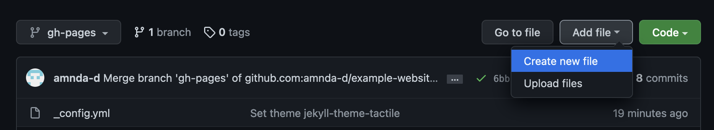

To create a new page on your website, simply add another markdown file to your website's repository. In the repository, click **Add file** and then **Create new file**. This will open a text editor in GitHub.



Name the file something like `about.md` or `publications.md` or whatever you want the page to be called. Add whatever content you want to the page, and then click **Commit changes**.

Your new page should now be visible at `username.github.io/pagename`, where `pagename` is whatever you named the file.

Of course, you'll want to link to the page from your website's home page. To do this, edit your `index.md` file and add a link to the markdown:

```markdown
[Your New Page](pagename.md)
```

You can also link to pages in [header links](header.md).

<button>[Back to Tutorial](index.md)</button>
