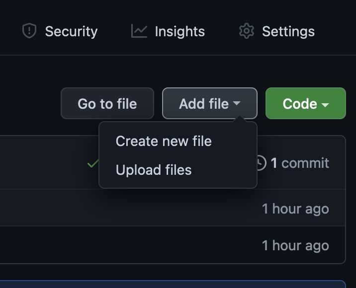
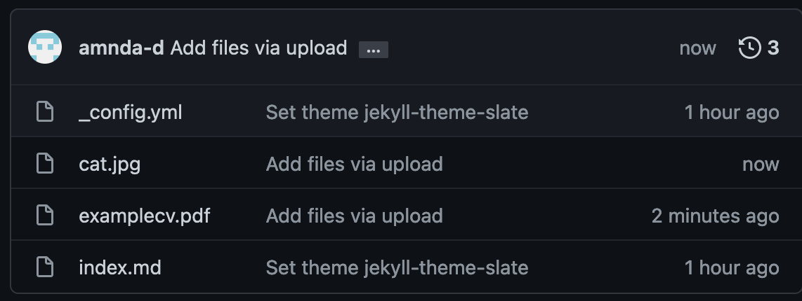

To add images, PDFs, or other files to your website, you'll need to upload them to your repository. Go to your repository on GitHub at `https://github.com/username/username.github.io` and click **Add file** and then **Upload files**. Select any files you want to add, and then click **Commit changes** as you did before.



Now, when you look at your repository, you should see the new files listed.



To display an image on your website, go to the editor for your `index.md` file (or whatever page you want the image on). Add the following markdown, replacing `img_name.png` with the filename of the image you uploaded:

```markdown

```

After commiting changes, the image should be rendered at full size on your website. If you'd like to change the size of the image, use the following HTML, replacing the width and height numbers with the size you want the image displayed at:

```

```

Other files, like PDFs (useful if you want to include a CV or a paper) can be linked to with Markdown as follows:

```markdown
[Text displayed for link](file_name.pdf)
```

You can also link to web pages outside of your website in a similar way:

```markdown
[Google](https://www.google.com)
```

<button>[Back to Tutorial](index.md)</button>
